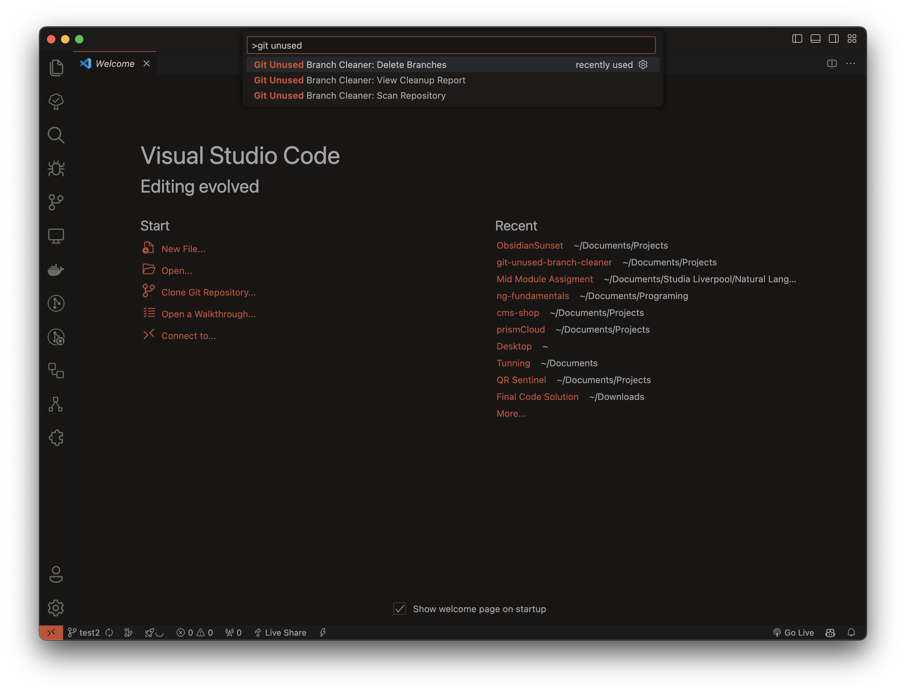
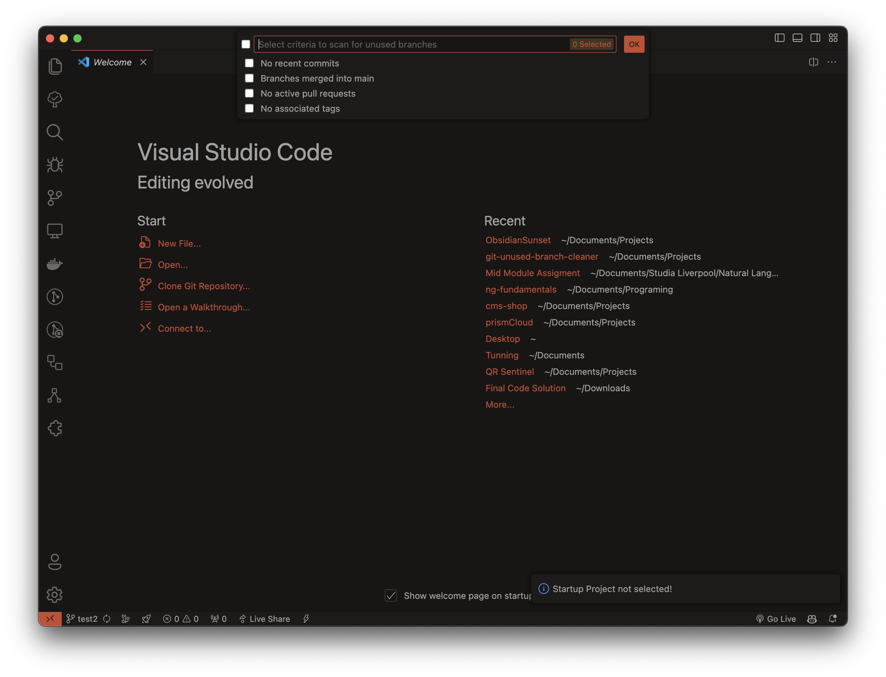
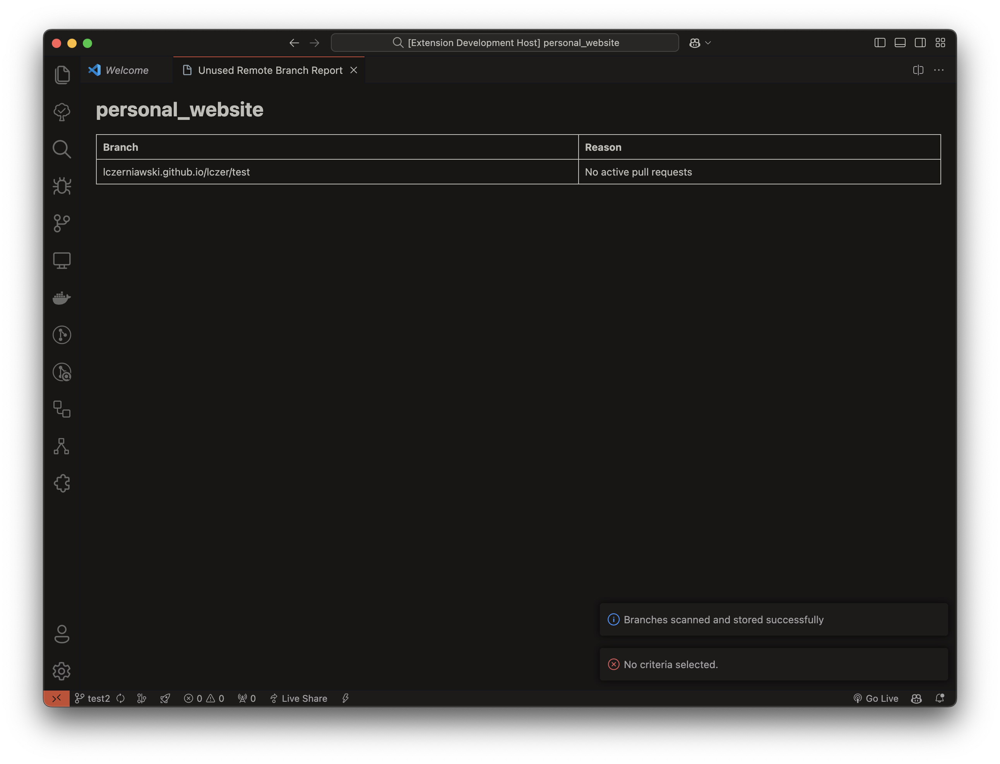
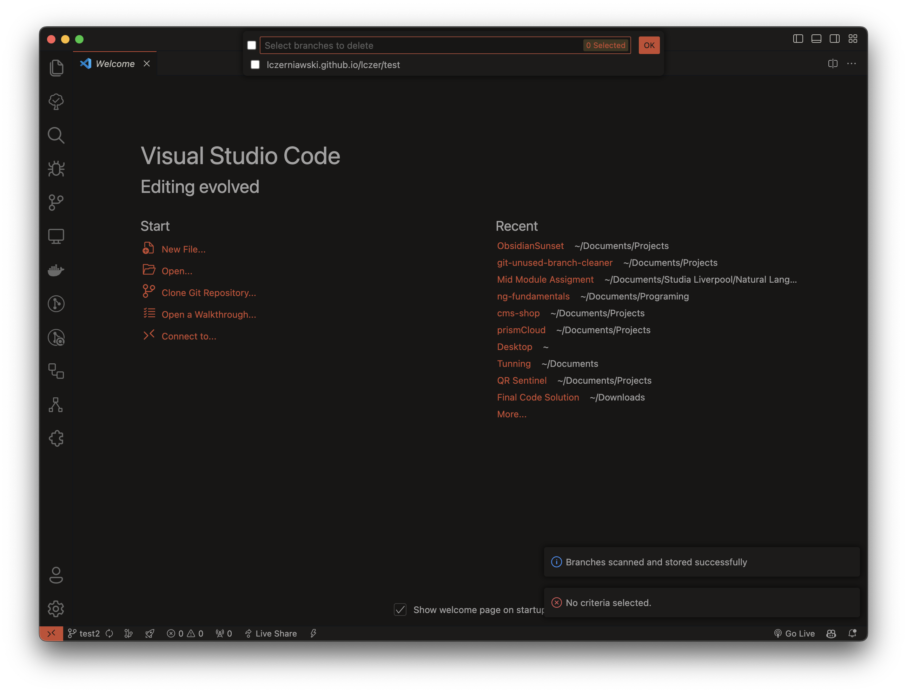
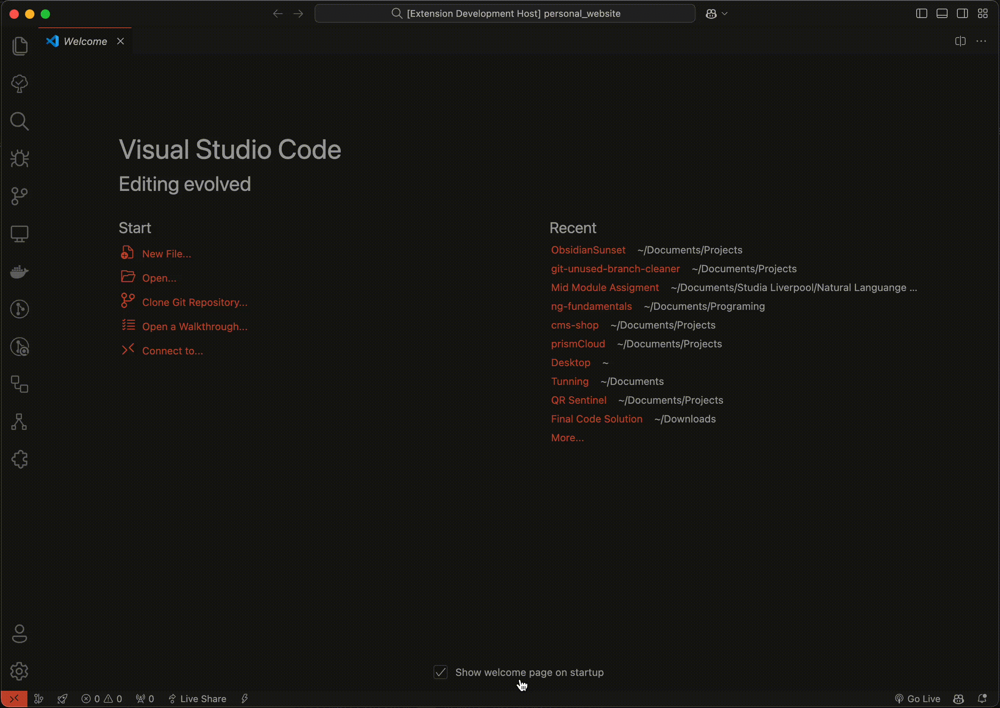

# Git Unused Branch Cleaner - VS Code Extension

## Overview

The **Git Unused Branch Cleaner** extension helps developers and teams manage Git branches efficiently by identifying and cleaning up unused or outdated remote branches. In large projects, old branches can accumulate and create unnecessary clutter, making it harder to maintain a clean repository. This extension scans your repository and provides a report of remote branches that are safe to delete or archive based on various criteria, helping keep your project organized and your Git history clean.

## Problem

Large projects often accumulate unused or outdated Git branches over time. This can lead to:

- Difficulty navigating through branches
- Increased clutter in the repository
- Potential for mistakes or confusion when working with outdated branches

## Solution

The **Git Unused Branch Cleaner** extension scans your repository and identifies remote branches that are unused or outdated based on criteria like:

- No recent commits
- Branches merged into main
- No associated pull requests
- No tags associated with branch

This allows you to clean up your remote branches safely, reducing clutter and maintaining a more organized Git repository.

## Key Features

- **Branch Scanning**: Automatically scans your Git repository to identify unused or outdated remote branches.
- **Cleanup Report**: Generates a detailed report of remote branches that are safe to delete or archive.
- **Batch Delete**: Delete multiple unused remote branches in a single operation to keep your repository clean.
- **GitHub & Azure DevOps Integration**: Supports integration with both GitHub and Azure DevOps, providing additional metadata such as pull requests.
- **Customizable Criteria**: Configure the conditions for detecting unused branches (e.g., no commits in the past X days, no open PRs).

## Screenshots

## Installation

### Prerequisites

Make sure you have Git installed and that your repository is already initialized with Git. You’ll also need access to GitHub or Azure DevOps if you plan to integrate with those services.

### Steps

1. Open Visual Studio Code.
2. Go to the Extensions view by clicking on the Extensions icon in the Activity Bar on the side of the window.
3. Search for "Git Unused Branch Cleaner" in the Extensions Marketplace.
4. Click **Install** to install the extension.

## Usage

1. After installing the extension, open your Git repository in VS Code.
2. Open the Command Palette (`Ctrl+Shift+P` or `Cmd+Shift+P` on macOS).
3. Search for and select `Git Unused Branch Cleaner: Scan Repository`.
4. A prompt will appear requesting the following details:
   - **Workspace Folder**: The path to the workspace you want to scan to be selected from currently opened workspaces.
   - **Main Branch Name**: The name of the main branch (e.g., `main`, `master`).
   - **Criteria**: Select one or few of predefined criteria.
   - **Days Since Last Commit**: Specify the number of days since the last commit to filter branches based on their activity.
   - **Remote URL**: Select one of connected repository remote URLs to integrate with GitHub or Azure DevOps for enhanced metadata.

   After entering this information, the extension will proceed to scan your repository and generate a list of remote branches that are considered unused or outdated based on the criteria provided.
5. You can now choose to:
   - **View the Cleanup Report**: A detailed list of safe-to-delete remote branches.
   - **Delete Branches**: Select multiple remote branches to delete in bulk.

## Integration with GitHub & Azure DevOps

The extension integrates with both GitHub and Azure DevOps to provide information about active Pull Requests.

If you're using GitHub or Azure DevOps, the extension will use these platforms' APIs to gather the latest data about your branches and help you make informed decisions about which branches to clean up.

## Commands

- `Git Unused Branch Cleaner: Scan Repository`  
  Scans the repository for unused remote branches and display a list of branches that are safe to delete.
  
- `Git Unused Branch Cleaner: View Cleanup Report`  
  Displays a list of remote branches that are safe to delete.

- `Git Unused Branch Cleaner: Delete Branches`  
  Deletes selected remote branches from the repository.

## FAQs

### Is this extension safe to use?

Yes, the extension generates a report before performing any deletions, the same branches as seen in report, will later be seen in a deletion screen selector. You must explicitly select the branches you wish to delete, ensuring that no branches are deleted accidentally.

## Contributing

Contributions are welcome! If you'd like to contribute to the development of this extension, feel free to fork the repository and submit a pull request. Please follow the contribution guidelines in the repository.

## License

This extension is licensed under the [MIT License](LICENSE).

## Acknowledgments

- GitHub API
- Azure DevOps API
- VS Code Extension API

---

For more information, bugs, or feature requests, visit the [Git Unused Branch Cleaner GitHub Repository](https://github.com/lczerniawski/Git-Unused-Branch-Cleaner-VSCode).